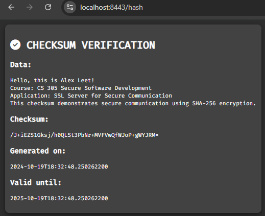
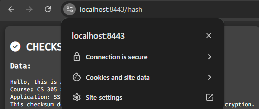

# 🛡️ CS 305 - Secure Software Practices for Artemis Financial


---

## 📑 Table of Contents

- [🛡️ CS 305 - Secure Software Practices for Artemis Financial](#️-cs-305---secure-software-practices-for-artemis-financial)
  - [📑 Table of Contents](#-table-of-contents)
  - [📖 Project Overview](#-project-overview)
  - [⚙️  Key Features](#️--key-features)
  - [🗂️ Project Structure](#️-project-structure)
  - [📸 Screenshots](#-screenshots)
    - [🔐 Checksum Verification](#-checksum-verification)
    - [🧑‍💻 Application Output in Spring Boot Console](#-application-output-in-spring-boot-console)
    - [🔒 Secure Communication](#-secure-communication)
  - [🔍 Vulnerability Assessment](#-vulnerability-assessment)
  - [🚀 How to Run the Project](#-how-to-run-the-project)
    - [Prerequisites](#prerequisites)
    - [Steps to Run](#steps-to-run)
  - [📝 Reflection and Insights](#-reflection-and-insights)
  - [📜 License](#-license)

---

## 📖 Project Overview

This project was completed as part of the **CS 305 Secure Software Development** course at Southern New Hampshire University. The goal was to implement secure communication mechanisms for a fictional financial services company, **Artemis Financial**. The project demonstrates the implementation of secure coding practices, including **SSL/TLS encryption** and **SHA-256 checksum verification**.

> **Note**: This project is for academic purposes, and Artemis Financial is a fictional company used for this scenario.

---

## ⚙️  Key Features

- 🔒 **SSL/TLS Encryption**: Secures communication over HTTPS using a self-signed SSL certificate.
- 🛡️ **SHA-256 Checksum Verification**: Verifies the integrity of transmitted data.
- 📊 **Vulnerability Analysis**: Static code analysis conducted using OWASP Dependency-Check.

---

## 🗂️ Project Structure

Here's a breakdown of the key files and their functionality:

- **`ChecksumController.java`**: Implements SHA-256 checksum functionality.
- **`SslServerApplication.java`**: The main entry point for the Spring Boot application.
- **`application.properties`**: Configures HTTPS and SSL certificates.
- **`pom.xml`**: Maven build configuration and dependencies.

---

## 📸 Screenshots

### 🔐 Checksum Verification

This screenshot demonstrates the **SHA-256 checksum verification** feature.



- **Data**: "Hello, this is Alex Leet!" is used as sample data for verification.
- **Checksum**: The generated SHA-256 checksum ensures the integrity of the transmitted data.
- **Generated On**: Timestamp showing when the checksum was created.
- **Valid Until**: Expiration timestamp, ensuring the validity of the checksum over time.

### 🧑‍💻 Application Output in Spring Boot Console

The console output shows the **Spring Boot** application starting and securing communication over HTTPS.


### 🔒 Secure Communication

This screenshot shows the **secure connection** established using SSL/TLS for HTTPS.



---

## 🔍 Vulnerability Assessment

As part of the project, a static analysis was performed using **OWASP Dependency-Check** to identify potential vulnerabilities in third-party libraries. The following table summarizes the critical and high-severity vulnerabilities found and their resolutions:

| Dependency                | Severity  | CVE ID          | Status               |
|---------------------------|-----------|-----------------|----------------------|
| `hibernate-validator-6.0.18` | Medium    | CVE-2020-10693  | Patched in updated version |
| `jackson-databind-2.10.2`   | High      | CVE-2020-36518  | Suppressed (false positive) |
| `spring-core-5.2.3.RELEASE` | Critical  | Multiple CVEs   | Patched               |

The complete Dependency-Check report is available [here](assets/reports/Dependency-Check-Report.pdf).

---

## 🚀 How to Run the Project

### Prerequisites

- Java 8 or higher
- Maven

### Steps to Run

1. **Clone the repository**:
   - Open a terminal or command prompt.
   - Run the following command to clone the project from GitHub:

    ```bash
    git clone https://github.com/AlexLeetDev/CS305_Project_SecureSoftwarePractices.git
    ```

2. **Navigate to the project directory**:
   - After cloning, navigate to the project directory:

    ```bash
    cd CS305_Project_SecureSoftwarePractices
    ```

3. **Build and run the project using Maven**:
   - Run the following command to build and start the project:

    ```bash
    mvn spring-boot:run
    ```

4. **Open your browser and access the secure checksum endpoint**:
   - Once the project is running, open your browser and go to:

    ```bash
    https://localhost:8443/hash
    ```

---

## 📝 Reflection and Insights

1. **Summary of Client Needs**:
   Artemis Financial required secure communication to protect sensitive financial data during transmission. The goal was to implement encryption and data integrity checks to ensure the security of transmitted information.

2. **What I Did Well**:
   I successfully implemented **SHA-256 checksum verification** and **SSL/TLS encryption**, ensuring that data transferred between the client and the server was both secure and tamper-proof. These security measures are essential for protecting sensitive data and maintaining the trust of users.

3. **Challenges and Learnings**:

   - **SSL/TLS Encryption**: Configuring SSL/TLS encryption and certificates for secure communication was challenging, but it improved my understanding of encryption protocols and certificate management.

   - **Dependency Management**: Handling version conflicts in **Maven** dependencies required careful attention to ensure all libraries worked together without introducing vulnerabilities.

   - **Vulnerability Assessment**: Using **OWASP Dependency-Check**, I had to identify relevant vulnerabilities and filter out false positives, particularly for unused features, enhancing my ability to prioritize real security risks.

4. **Tools and Practices Used**:  
   - **Java Keytool**: For generating and configuring SSL certificates.
   - **OWASP Dependency-Check**: For static analysis of project dependencies to identify and address potential vulnerabilities.
   - **Maven**: For project management and handling dependencies efficiently.

5. **What to Showcase to Future Employers**:
   This project highlights my ability to implement secure communication protocols like SSL/TLS, verify data integrity with SHA-256 checksum, and conduct vulnerability assessments using tools like OWASP Dependency-Check. These are important skills in secure software development.

---

## 📜 License

This project is licensed under the MIT License. You are free to use, modify, and distribute this software as long as you include the original license.

For more details, see the [LICENSE](./LICENSE) file.
